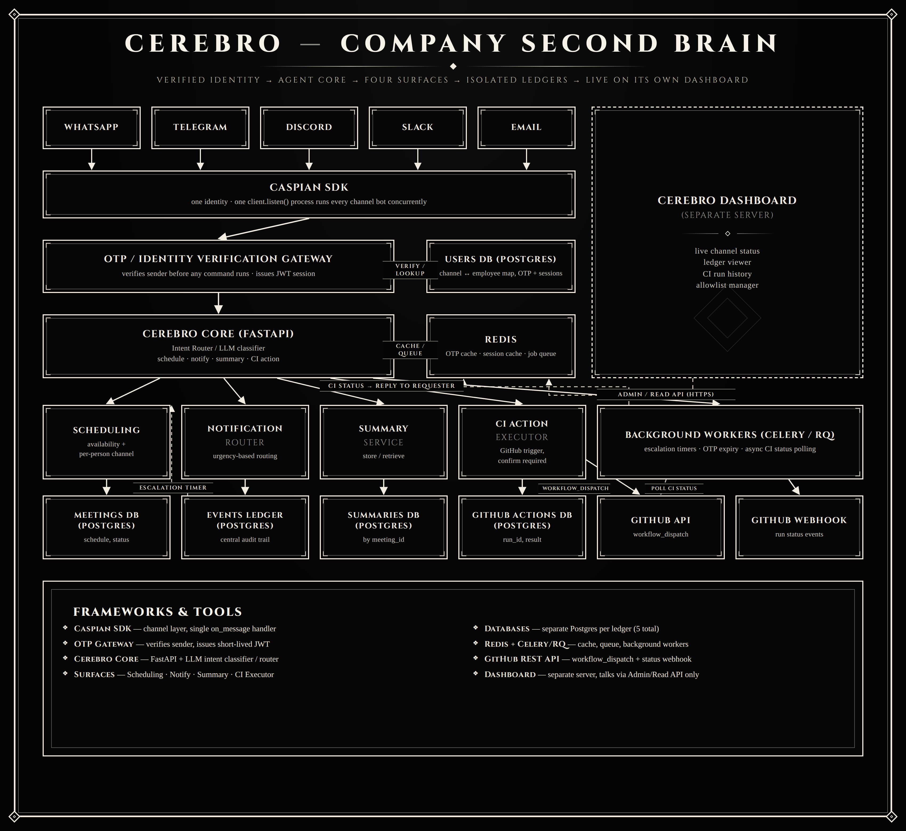

# CEREBRO

### The company second brain.


Cerebro is an office workspace assistant, a CI monitor, and a multichannel agent, running as one identity across every channel your company already lives in.

You do not open a new app. You do not learn a new interface. You message Cerebro on WhatsApp, Telegram, Discord, Slack, or Email, and the office answers back.

**walk out of your prison, work anywhere**

**because the only time one should be enclosed in a box, is when they are dead**

---

## What it does

Cerebro sits between your people and your systems. It verifies who is talking, works out what they want, and then does it: books the meeting, chases the person who has not replied, remembers what was decided, and fires the deploy.

**Multichannel by default.** One agent, five surfaces. WhatsApp, Telegram, Discord, Slack, and Email all reach the same brain, share the same memory, and speak with the same voice. Your ops lead lives in Slack, your field team lives on WhatsApp, and the client only ever replies to Email. Cerebro does not care.


**Verified identity, always.** Nothing runs for a stranger. Every sender is resolved to a real employee through an OTP handshake before a single command executes. A verified sender gets a short lived session, and that session is what carries authority, not the phone number or the chat handle.

**Scheduling that knows the room.** Cerebro checks real availability, proposes slots, and reaches each attendee on the channel that person actually reads. No more polls in a thread nobody opens.

**Notification routing by urgency.** Not everything is a ping at 2am, and not everything can wait until Monday. Cerebro classifies urgency and routes accordingly: quiet things land in the ledger, loud things escalate, and if nobody responds, the escalation timer fires on its own.

**Meeting memory.** Summaries are stored per meeting and retrievable by anyone with the right to see them. Ask what was decided about the vendor contract and you get the answer, not a scroll through a dead thread.

**CI as a conversation.** Trigger a workflow, watch it run, and get told how it ended, all from the same chat window you were already complaining in.

**A central audit trail.** Every event that passes through Cerebro is written to a ledger. Who asked, what ran, what it returned, when.

**more to life, less to arrangements**

---

## Architecture

Verified identity, then agent core, then four surfaces, then isolated ledgers, then live on its own dashboard.



---

## How it works

### 1. One process, every channel

The Caspian SDK is the channel layer. It normalises WhatsApp, Telegram, Discord, Slack, and Email into a single `on_message` handler, and runs every channel bot concurrently inside one `client.listen()` process. Adding a surface does not mean adding a service.

```bash
# one identity, five doors into it
whatsapp  ->
telegram  ->
discord   ->  caspian sdk  ->  on_message(sender, channel, text)
slack     ->
email     ->
```

### 2. Prove who you are, once

Before any command reaches the core, the sender hits the OTP and Identity Verification Gateway. The gateway maps the channel handle to an employee record, sends a one time code, and on success issues a short lived JWT session. OTPs and sessions live in Redis with expiry, the durable channel to employee mapping lives in the Users database.

```bash
unknown sender      ->  otp challenge  ->  code verified  ->  jwt session issued
verified session    ->  straight through to the intent router
expired session     ->  re-challenge, no commands run in the meantime
```

### 3. Work out what was actually meant

Cerebro Core is a FastAPI service fronting an LLM intent classifier. Free text becomes one of four actions, with the arguments pulled out of the sentence.

```bash
"can you get me and priya on a call thursday afternoon"   -> schedule
"tell the backend team the staging db is down"            -> notify
"what did we decide about the vendor contract"            -> summary
"deploy the api to staging"                               -> ci action
```

### 4. Four surfaces do the work

**Scheduling** reads availability, resolves each attendee to their preferred channel, and writes schedule and status to the Meetings ledger.

**Notification Router** grades urgency and routes on that grade. Everything it sends is mirrored into the Events ledger, which is the central audit trail for the whole system.

**Summary Service** stores and retrieves meeting summaries keyed by meeting id, in the Summaries ledger.

**CI Action Executor** is the only surface that will not act on the first ask. It requires an explicit confirmation, then calls the GitHub REST API with `workflow_dispatch`, and records `run_id` and result in the GitHub Actions ledger.

### 5. Nothing important is fire and forget

Background workers on Celery or RQ handle everything that has to happen later rather than now: escalation timers when a notification goes unanswered, OTP expiry, and asynchronous polling of CI status. Redis is the queue and the cache.

### 6. CI that reports back to whoever asked


A dispatched workflow does not leave you refreshing a browser tab. The GitHub webhook pushes run status events back into Cerebro, the workers reconcile them against the stored `run_id`, and the result is delivered as a reply to the person who triggered it, on the channel they triggered it from.

```bash
"deploy api to staging"     ->  confirm required
"yes"                       ->  workflow_dispatch  ->  run_id stored
                                webhook: in_progress
                                webhook: completed / success
"api deployed to staging, run 18442, 3m 12s"   <-  reply on the original channel
```

### 7. Five ledgers, kept apart


Each concern gets its own Postgres database rather than sharing a schema. Users, Meetings, Events, Summaries, and GitHub Actions. Five ledgers, five blast radii. A scheduling migration cannot take identity down with it, and the audit trail cannot be quietly rewritten by the service it is auditing.

```bash
users db      ->  channel to employee map, otp, sessions
meetings db   ->  schedule, status
events db     ->  central audit trail
summaries db  ->  by meeting_id
actions db    ->  run_id, result
```

### 8. A dashboard that is genuinely separate

The Cerebro Dashboard runs as its own server and never touches the databases directly. It talks to the core over an Admin and Read API on HTTPS, and nothing else. From it you get live channel status, a ledger viewer, CI run history, and the allowlist manager that decides who is allowed to exist in the system at all.

---

## Frameworks and tools

**Caspian SDK** is the channel layer, one `on_message` handler for all five surfaces.

**OTP Gateway** verifies the sender and issues the short lived JWT that carries authority.

**FastAPI plus an LLM classifier** is the core, routing free text to one of four actions.

**Scheduling, Notification, Summary, and CI Executor** are those four actions.

**Postgres** holds the data, one separate database per ledger, five in total.

**Redis with Celery or RQ** covers cache, queue, and the background workers.

**GitHub REST API** handles `workflow_dispatch` out and run status webhooks back in.

**The dashboard** is its own server, reaching the core through an Admin and Read API only.

---

## Why it helps the office

The cost of coordination is not the meeting, it is everything around the meeting. Finding the slot. Chasing the reply. Remembering the decision. Checking whether the thing shipped. Cerebro absorbs that layer and hands back the part of the day you actually got hired for.

It works because it meets people where they already are. There is no adoption curve for a system that arrives as a message from a contact you already have.
